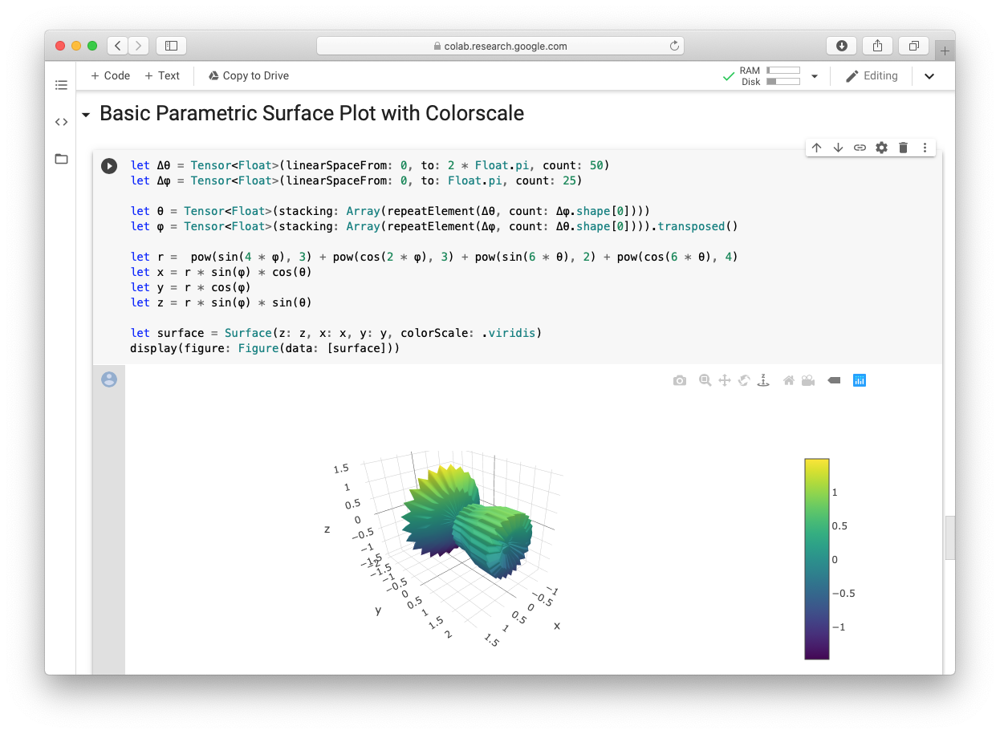

# Examples


## Jupyter Notebooks
 
- ### [`Showcase.ipynb`](Notebooks/Showcase.ipynb) [![ColabBadge]](https://colab.research.google.com/github/vojtamolda/Plotly.swift/blob/master/Examples/Notebooks/Showcase.ipynb)
- ### [`Machine Learning.ipynb`](Notebooks/Machine%20Learning.ipynb) [![ColabBadge]](https://colab.research.google.com/github/vojtamolda/Plotly.swift/blob/master/Examples/Notebooks/Machine%20Learning.ipynb)

[ColabBadge]: https://colab.research.google.com/assets/colab-badge.svg "Run in Google Colab"

By far the quickest way to get started is to open an empty [Google Collaboratory](https://colab.research.google.com/) notebook via the link [here](https://colab.research.google.com/github/tensorflow/swift/blob/master/notebooks/blank_swift.ipynb) or the buttons above.


 
Running Swift code in [Jupyter](https://jupyter.org/) locally requires installing Swift kernel from the [swift-jupyter](https://github.com/google/swift-jupyter). After installing, the first line of the notebook has to download, build and link the Plotly module. Subsequent cells can then import and use it.

```swift
%install '.package(url: "https://github.com/vojtamolda/Plotly.swift.git", branch("master"))' Plotly
```
```swift
import Plotly
```


## XCode Playgrounds

- ### [`Playground.xcworkspace`](Playgrounds/Playground.playground/Contents.swift)

Getting Plotly working in an XCode requires an extra step. As of XCode 11 there's no direct support for importing Swift Package Manager (SPM) modules to Playgrounds. However, it's possible to work around this by generating a `Plotly.xcodeproj` project and using it to replace the SPM. The steps to achive it are described below.


 1. Generate Xcode project with the following command:
    ```shell script
    $> swift project generate-xcodeproj
    ```
    > This will create `Plotly.xcodeproj` that contains an XCode project equivalent to `Package.swift`.
2. Open  `Playground.xcworkspace` in XCode. The example blindly references `Plotly.xcodeproj` that doesn't normally exist in the repository.
    > If you are creating your own workspace from scratch then click on *File* -> *Add Files ...* menu and navigate to `Plotly.xcodeproj`.
3. Select `Plotly-Package` scheme and then manually build it via *Product* -> *Build* menu.
     > This is necessary to make `import Plotly` work. Otherwise, the playground code will fail to compile.
4. Run the code in the demo playground.
     > The key trick is the last line. It sets the `liveView` property of the current Playground page to a view containing the figure.
